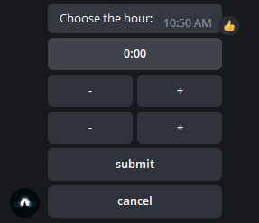

# telegraf-time-picker
Inline time picker for Telegram bots using Telegraf framework.

Description
================
Using this simple inline time picker you can select the time by clicking. This library is built using [Telegraf](https://github.com/telegraf/telegraf) framework.

Usage
================
Installation
---------------

```
npm i telegraf-time-picker --save
```

Basic usage
---------------
```typescript
const bot = new Telegraf(process.env.BOT_TOKEN);

// instantiate the time picker
const timePicker = new TimePicker(bot);

// pass the callback to setTimePickerListener()
timePicker.setTimePickerListener((context, time) => context.reply(time));

// retreive the time picker interface
bot.command('timepicker', (context) => {
    context.reply('Choose the hour:', timePicker.getTimePicker('0'));
});
```

Example
-----------

You can reference [here](./src/bot.ts), a simple working bot.

